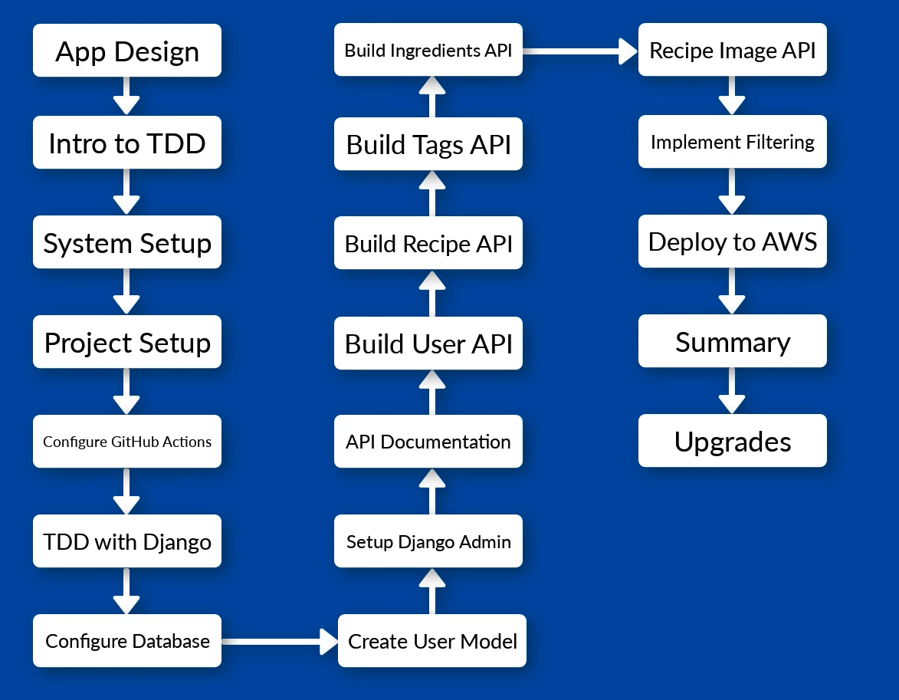

## About the course

**Course structure**


**Technologies**

    python
    Django
        - url mappings
        - object relational mapper
        - admin site
    Djando rest framework
        - Django add-on
        - build REST APIs
    postgresql
    docker
        - development environment
        - deployment
    swagger
        - documentation
        - browsable api (testing)
    GitHub actions
        -automation (testing and linting)


**django project structure**

    ```
    ├── Apps
    │   ├── app/- # Django project itself
    |   |
    │   ├── app/core- # Code shared between multiple apps,i.g. databased definition using Django models
    |   |
    │   └── app/user- # User related code, i.g. user registration, creating authentication tokens
    |   |
    │   └── app/recipe- # Recipe related code, i.g. handling and updating ingredients and tags and managing
    
    ```


## Project Setup
1. Create a github proj.
   - create a [dockerHub]()https://hub.docker.com/ account.
   - Go to Account settings, create a personal access tockens, and name it as 'recipe-app-api'
   - Go back to the github repository we just created, click Settings - Secrets and Variables -> actions. Create two repository secrets `DOCKERHUB_USER` and `DOCKERHUB_TOKEN`, put in our dockerhub username and the tocken we just generated.
2. An overview of how are we gonna use docker in this proj
   1. Configure Docker
      - Create a Dockerfile, define operating system level dependencies
      - List steps for creating image
        - choose a base image(python)
        - install dependancies
        - setup users
   2. Docker Compose 
      - How our docker images should be used 
      - Define our "services"
        - name(i.g.: app)
        - Port mappings 
        - Volumn mappings
   3. Using Docker Compose
      - Run all commands through Docker Compose, i.g.
       ```bash
       docker-compose run --rm app sh -c "python manage.py collectstatic"
       ```
       - `docker-compose` runs a Docker Compose command
       - `run` will start a specific container defined in config
       - `--rm` removes the container once it's finished running
       - `app` is the name of the service
       - `sh -c` passes in a shell command
       - The rest is the command to run inside container
3. Create `requirement.txt` file, set the version of Django and Django rest.
4. Create proj Dockerfile and .dockerignore, find the comments inside the file.
5. run `docker build .` to build the image.
6. Create docker-compose.yaml file and then run `docker-compose build` to build the services.
7. Linting. (will be wrapped in github action)
    - What's linting?
      - Tool to check code formatting
      - Highlights errors, typos, formatting issues
    - How we'll handle linting?
      - install `flake8` package
      - Run it through Docker Compose

    - Configure `flake8`
      - Create file `requirement.dev.txt`, This file is used to separate development-only dependencies from the core project dependencies. It allows us to install tools such as `flake8` only when building images for local development, while excluding them from production images. This keeps the production image smaller, cleaner, and free of unnecessary packages.
      - Head over to `Dockerfile`. `COPY` the `requirement.dev.txt` file into the container. Add `ARG DEV=false` above the `RUN` line. In the `RUN` line, add a command to delete the `requirement.dev.txt` file if exist.
      - In `docker-compose.yaml`, set a build argument `DEV=true`, which means when runing this compose file, we are in a develop env, but by defaul(Dockerfile), we are not running a dev mod.
      - Create a `/app/.flake8` file. Inside of it, tells `flake8` to ignore the dir and files from the listing.
      - Run the command below to make sure flake8 has been installed correctly       
        ```bash
        docker-compose run --rm app sh -c "flake8"
        ```
8. Testing (will be wrapped in github action)
   - Django test suite
   - setup ests per Django app
   - Run tests through Docker Compose
    ```bash
    docker-compose run --rm app sh -c "python manage.py test"
    ```
9. Create Django proj
    ```bash
    docker-compose run --rm app sh -c "django-admin startproject app ."
    ```
    Since `/app` is bind mount(Two-way synchronization), after run the command above, the files appare immediately on the local file system.
    Here is the new structure
    ```
    ├── app/
    │  ├── app/
    |  |   |
    |  │   ├── __init__.py
    |  |   |
    |  │   └── asgi.py
    |  |   |
    |  │   └── settings.py
    |  |   |
    |  │   └── urls.py
    |  |   |
    |  │   └── wsgi.py        
    |  |   |
    |  └── .flake8
    |  └── db.sqlite3
    |  └── manage.py
    ```


10. Run proj
    ```bash
    docker-compose up
    ```
    and then enter http://127.0.0.1:8000/, here is what you should see:
    


## Docker Commands & Volumes Quick Reference

### Commands

- **`docker build`**
  - Builds a **single Docker image** from a `Dockerfile`
  - Does **not start a container**
  - 💡 Think: “Make the image for one service”

- **`docker-compose build`**
  - Builds images for **all services** defined in `docker-compose.yaml`
  - Uses `Dockerfile` specified in each service
  - Does **not start containers**
  - 💡 Think: “Prepare all images for the app stack”

- **`docker-compose up`**
  - Builds images if needed **and starts all services** together
  - Runs containers based on `docker-compose.yaml`
  - 💡 Think: “Bring up the full app stack”

- **`docker-compose run`**
  - Starts a **one-off container** for a service
  - Can override the default command
  - Does **not automatically start other linked services** (unless `--service-ports` or `depends_on` used)
  - 💡 Think: “Run a single task or experiment in a container”


## Docker Build vs Docker Compose Build

### `docker build`
- Reads the **Dockerfile directly**
- You explicitly specify:
  - Build context
  - Dockerfile location
  - Build arguments (`--build-arg`)
- Used mainly for building **one image manually**

💡 Think: *“I describe exactly how to build this image.”*

---

### `docker-compose build`
- First reads **`docker-compose.yaml`**
- Uses values defined under `build`, such as:
  - `build.context`
  - `build.dockerfile`
  - `build.args`
- Then executes the **Dockerfile** using those inputs
- Commonly used for **multi-service applications**

💡 Think: *“Docker Compose describes the build for me.”*

---

### Are the resulting images the same?
- **Yes**, in most cases, the images are identical
- **Only if** the following inputs are the same:
  - Dockerfile
  - Build context
  - Build arguments
  - Target stage / platform

---

### Why images can be different
Docker images differ when **Docker Compose supplies different inputs** to the Dockerfile than `docker build` does.

Common reasons:
- Different `ARG` values (e.g. `DEV=true`)
- Different build context
- Different target stage
- Different platform

📌 The Dockerfile stays the same, but **its inputs change**, resulting in a different image.

---

### Key takeaway
> `docker build` and `docker-compose build` both execute a Dockerfile.  
> The image is the same **only when the Dockerfile and all build inputs are the same**.


### Volumes

- **Bind Mount**
  - Mounts a **host directory** into a container
  - Changes on host ↔ reflected in container, vice versa
  - ⚠️ Risky for databases (permissions, corruption)
  - Typical use: **Code & config files during development**

- **Named Volume**
  - Docker-managed storage, lives inside Docker
  - Persistent across container restarts
  - Cannot easily edit files directly on host
  - Typical use: **Databases, persistent data, caches**

### Quick Memory Tips

- **Commands:**  
  - `build` → Prepare  
  - `up` → Run stack  
  - `run` → One-off container

- **Volumes:**  
  - `Bind` → Host ↔ Container  
  - `Named` → Docker ↔ Container
