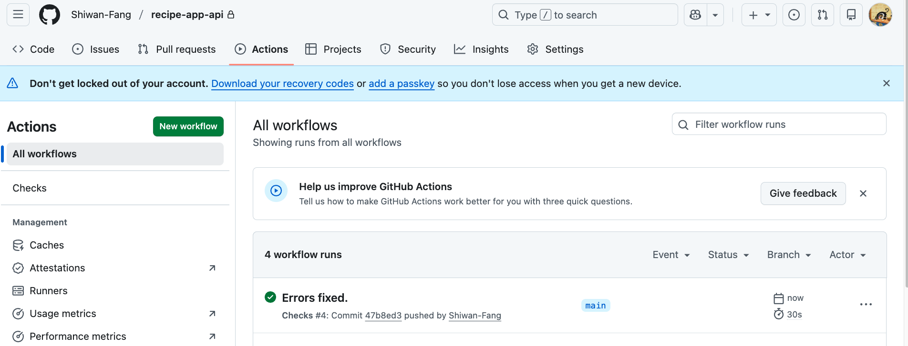

## Configuring GitHub Actions

### What GitHub Actions?
- automation tool
- Similar to Travis-CI, GitLab CI/CD, Jenkins
- Run jobs when code changes
- Common uses:
    - Depolyument (not be covered in this course)
    - Code linting
    - Unit tests
- How it works
    - Trigger (push to github) ->Job (Run unit tests) -> Result (success/fail)
  
###  Configuration

How?
- Creatw a config file at `.github/workflow/checks.yaml`, the name of the file doesn't matter.
  - Set trigger as push, meaning everytime we push the code to out github repo, it will trigger github actions
  - Add steps for running testing and linting
- Configure DockerHub authentication. (Done in [project setup section](notes/1_Proj_setup.md))
- Test GitHub actions
  Head over to our git proj -> push our code in the terminal -> refresh the github action page, here is what you should expect:
  

## Test Driven Development with Django

### Testing in Django
  #### Django test framework
  - Based on the unittest library
  - Django adds features 
    - test client - dummy web brower
    - simulate authentication
    - temporary database
      - test code that uses the DB
      - specific database for tests
      - runs test -> clear data -> run another test
  - Django REST framework adds features
    - API test client

  #### Where do you put tests?
  - placeholder `tests.py` added to each app
  - Or, create `tests/` subdir to split tests up
  - Keep in mind:
    - only use `tests.py` or `tests/` dir
    - the name of test modules must start with test_
    - test dir must contain `__init__.py`

  #### Test classes
  - `SimpleTestCase`
    - no database integration 
    - useful if no database is required for your test
    - save time executing tests
  - `TestCase`
    - databasse integration
    - useful for testing code that usese the database

  #### Writing tests
  - import test class
    - `SimpleTestCase` -no database
    - `TestCase` -database
  - Import objs to test
  - define tset class
  - add test method
  - setup inputs
  - execute
  - check output
    
  #### Run Test
  ```bash
  python manage.py test
  ```

### Write a Test Manually using Django
This section shows you the test runs by using Django mamually, while building the api this part will be handled by github action.
1. Now create two files under `./app/app`. 
```
├── app
│   ├── test.py
|   |
│   ├── calc.py
```

2. write a simple functions inside the calc.py 
```python
"""
Calculator funtions
"""

def add(x, y):
    """Add x and y and return the rsult."""
    return x + y
```

3. write the test in test.py

```python
"""
Sample test
"""
from django.test import SimpleTestCase

from app import calc

class CalcTests(SimpleTestCase):
    """Test the calc module"""

    def test_add_numbers(self):
        """Test adding numbers together"""
        res = calc.add(5, 6)

        self.assertEqual(res, 12)
```

4. run the test inside the terminal:
```bash
docker-compose run --rm app sh -c "python manage.py test" 
```

Here is what you should expect if the test passes:
```
Container recipe-app-api-app-run-75a23708f815 Creating 
Container recipe-app-api-app-run-75a23708f815 Created 
System check identified no issues (0 silenced).
.
----------------------------------------------------------------------
Ran 1 test in 0.000s

OK
```

### Write a test using TDD
Write a test for behaviour expected to see in code -> test fails -> write code so test passes -> then you can refactor the code furhter

### Mocking
- what is it?
   - override or change behaviour of dependencies
   - avoid unintented side effects
   - isolate code being tested, making tests more reliable and accurate
- why use?
  - avoid relying on external services
    - can't guarantee they will be available 
    - makes tests unpredictable and inconsistent
  - avoid unintended consequences
    - accidentally sending emails 
    - overloading external services
  - speed up the tset
- example 
  - rigister_user() -> created_in_db() -> send_welcome_email(). By mocking sending email to prevent email being send and ensure send_welcome_email() called correctlly
  - check_db() -> sleep() -> check_db(), by replace sleep() with a mock obj to prevent it actuallbe being called to speed up the test
- how to mock code?
  - use `unittest.mock` package
    - `MagicMock/Mock` - replace real objects
    - `patch` - overrides code for tests


### Testing web requests
- Django REST framework APIClient
  - based on the Django's TestClient
  - make requests
  - check result
  - overrude authentication
  
- Using APIClient
  - import APIClient
  - create client 
  - make request
  - check result 

