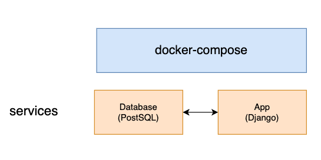
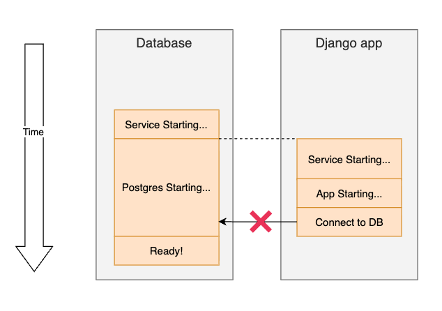
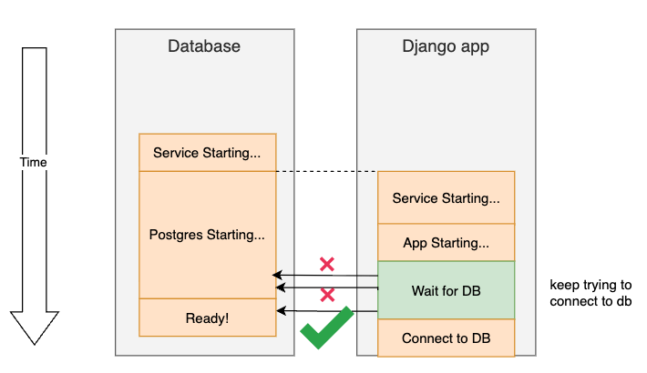
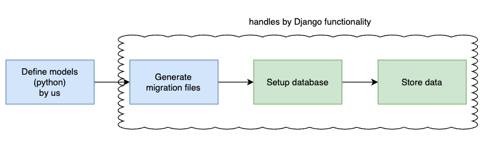

## DB Architecture Overview


- PostSQL
- Docker Compose
  - defined with proj(re-usable)
  - persistent data using volumes
  - handles network configuration
  - enviromnment variable configuration


## Add database servise in docker-compose.yaml

```yaml
services:
  app:
    environment: # the values here are for development only, do not use in production, and need mapping to the db service below to create the database connection
      - DB_HOST=db
      - DB_NAME=dev_db
      - DB_USER=dev_user
      - DB_PASS=changeme
    depends_on: # will ensure that the db service is started before the app service
      - db

  db:
    image: postgres:13-alpine
    volumes:
      - dev-db-data:/var/lib/postgresql/data # use a named volume to persist database data
    environment:
      - POSTGRES_DB=dev_db
      - POSTGRES_USER=dev_user
      - POSTGRES_PASSWORD=changeme

volumes:
  dev-db-data: # no need to specify the name after the colon, docker-compose will store it automatically to the default location
```
- Network conectivity
  - Set `depends_on` on `app` servcie to start `db` first
  - docker compose create a network automatically
  - the `app` service can use `db` host name
  
- Volumes
  - store persistent data
  - maps dir in container to local machine
  - the path before the colon is the path on our local machine, and the one after colon is the path in the container

Find more instructions about Postgres on [it's dockerhub webpage](https://hub.docker.com/_/postgres).

## Database configuration with Django
***Steps***

***1. Configure Django (tell Django how to connect)***
  - what Django needs to know (defined in `setting.py`, the last three match up in `docker-compose.yaml` that we set before)
    - engine (type of database)
    - host name (ip or domain name for database)
    - port (5432)
    - database name
    - username 
    - password

    ```python
    DATABASES = {
      'default': {
          'ENGINE': 'django.db.backends.postgresql',
          'HOST': os.environ.get('DB_HOST'),
          'NAME': os.environ.get('DB_NAME'),
          'USER': os.environ.get('DB_USER'),
          'PASSWORD': os.environ.get('DB_PASS'),
      }
  }
    ```

  - Environment variables
    - pull config values from env variables
    - easily passed to docker (standard ways)
    - used in local dev or production env
    - single place to configure project
    - easy to do with python `os.environ.get('DB_HOST')`
  
  - remove .app/app/db.sqlite3 which were genarated automatically.


***2. Install database adaptor dependencies (install the tool Django uses to connect)***
  - Psycopg2
    - the package that you need in order for Django to connect to our database
    - most popular PostgreSQL adaptor for python
    - supported by Django
    - installation options
      - `pysopg2-binary`
        - ok for dev
        - not good for prodction
      - `psycopg2` (we will use this one)
        - compiles from source 
        - required additional dependencies
        - easy to install with docker
    - installing `psycopg2`
      - list of package dependencies in docs
        - C compiler
        - python3-dev
        - libpq-dev
      - equivalent packages for Alpine
        - postgresql-client
        - build-base
        - postgresql-dev
        - musl-dev
      - docker best practice:
        - clean up build dependencies. clean up the last thress dependencies after psycopg2 is installed, keep container light and clean. And when we are running in production, we don't have any excess packages that aren't actually there specifically for running our application.
    - Install PostgreSQL database adaptor
      - To install the adaptor, we need to download the dependencies first. Head over to `Dokcerfile`, insert the code in `RUN` command, after we install pip.
        ```bash
            apk add --update --no-cache postgresql-client &&\
            apk add --update --no-cache --virtual .tmp-build-deps \    
                build-base postgresql-dev musl-dev && \
        ```
        And then delete the packages above except postgresql-client package after we remove the /tmp file.
        ```bash
        apk del .tmp-build-deps && \
        ```

***3. Update Python requirements***
  - Move to `requirements.txt`, define the version of psycopg2 we want to install.
  - open the terminal, run `docker-compose build` to build the new image.


## Fixing database race condition
***Peoblem with Docker compose***
Using `depends_on` ensures service starts, but doesn't ensure application is running. Here is an example timeline that Django app tries to connect ro Postgres, but failed since postgres is not ready to be connectted yet.



Solution:
- make Django "wai for db"
  - check for database availability
  - continue when database ready
- create custom Django mangement command
  
New timeline



***Create core app***
1. Add a template app `core` to our project.
   ```bash
   docker-compose run --rm app sh -c "python manage.py startapp core"
   ```
   After running the command above, delete the `tests.py`, `views.py`, since we don't need it.
2. Create a new dir `tests/`, add `__init__.py`.
3. Head over to `app/app/settings.py`, add core into `INSTALLED_APPS` to make sure the app is installed in our proj

***Write tests for wait_for_db command***
1. Create the dirs and file under `.app/core/`. Bc of the dir structure, Django will detect this as a management command that will allow us to run python manage.py

    ```
    ├── app
    │   ├── app/- # Django project itself
    |   |
    │   ├── app/core- 
    |   |   ├── app/core/management/-
    |   |   |   ├── __init__.py    
    |   |   |   ├── app/core/management/commands/-    
    │   │   │   │   └── __init__.py
    │   │   │   │   └── wait_for_db.py    
    ```
  Inside the wait_for_db.py, add minimun code we need for adding a Django management command.

2. Add the unit test.
   Create `test_commands.py` under `core/test/`

3. Add wait_for_db command in `.app/core/wait_for_db.py`.

Check the python files of the above two steps to find more explaination.

## Overview of database migration
- Django Object Relational Mapper(ORM)
  - Abstraction layer between the data and the actually database
    - Django handles database structure and changes, no need to write sql code, manually change the database tables etc.
    - allows you to focus on python code
    - allows you to use any database (within reason)
- Using ORM
  
- Models
  - each model maps to a table
  - models contain
    - name
    - fields
    - other metadata
    - custom python proj
  - example:
    ```python
    class Ingredient(models.Model):
        name = models.CharField(maxlength=255)
        user = models.ForeignKey(
          settings.AUTH_USER_MODEL,
          on_delete=models.CASCADE,
        )
    ```
  - Creating migrations
    - ensure app is enabled in settings.py
    - use Django CLI, `python manage.py makemigrations`
  - Applying migrations
    - use Django CLI, `python manage.py migrate`
    - run it after waiting for database

## Update docker compose and CI/CD for wait_for_db command
- Updata `docker-compose.yaml`. Modify the command code of app service.
  ```yaml
      command: >
      sh -c "python manage.py wait_for_db &&
      python manage.py migrate &&
      python manage.py runserver 0.0.0:8000"
  ```
- Update CI/CD. Head over to `.github/workflows/checks.yaml`, modify the tset step to make sure we run wait_for_db before running the test, just so to make sure the db has started before running the test.
  ```yaml
      - name: Test
        run: docker compose run --rm app sh -c "python manage.py wait_for_db && python manage.py test"
  ```