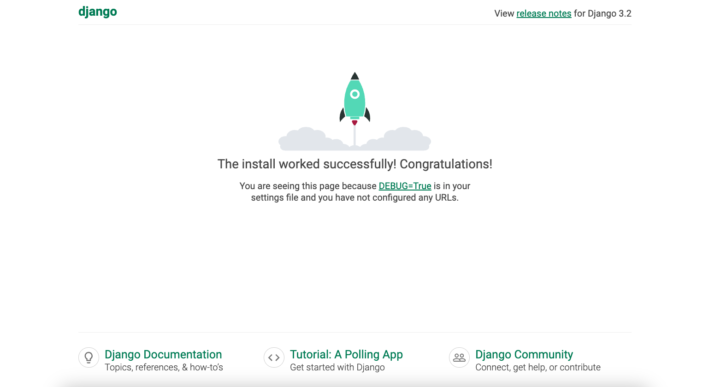
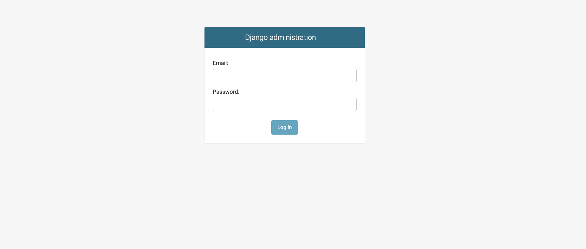
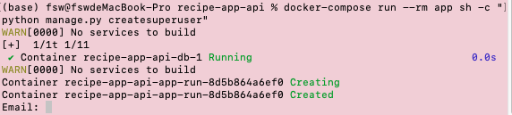
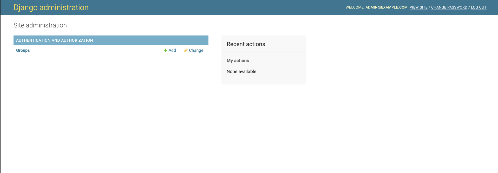

# Create User Model
**Section Summary**
- Create a custom user model
- Configure Django to use it 
- Handle normalising email
- Handle encrypting passwords


## Create Initial User Model
### The Django user model overview
Django web applications access and manage data through Python objects referred to as models. Models define the structure of stored data, including the field types and possibly also their maximum size, default values, selection list options, help text for documentation, label text for forms, etc. The definition of the model is independent of the underlying database — you can choose one of several as part of your project settings. Once you've chosen what database you want to use, you don't need to talk to it directly at all — you just write your model structure and other code, and Django handles all the dirty work of communicating with the database for you.

**Django authentication**
- build in suthentication system
- framework for basic features: regisgration, login, auth
- integrates with Django admin

**Django user model**
- A model in Django is a Python class that defines the structure of a database table.
- why do we need user model? Because your system needs to know:
    - who is registered
    - how they log in
    - what permissions they have
    - what data belongs to which user
- foundation of the Django auth system
- User model = table that stores user credentials + profile info + permissions
- have default user model, but not easy to customise & using username instead of email login
- create a custom model for new projects, allows for using email instead of username login

**How to customise Django user model**
1. create model 
   - `AbstractBaseUser` : provides features for authentication, doesn't include fields
    - `PermissionsMixin`: support for Django permission system, includes fields and methods
2. create custom manager, used for CLI integration
3. set `AUTH_USER_MODEL` in settings.py
4. create and run migrations

**Common issues when customising Django user model**
- Running migrations before setting custom model
- typos in config (doesn't really give you an error, hard to debug)
- indentation in manager or model


### User Model design
**user fields**
- email (EmailField)
- name (CharField)
- is_active (BooleanField)
- is_staff (BooleanField)

**user model manager**
- Base class for managing users
- useful helper methods
  - `normalize_email`: for storing emails consistenly
- methods we'll define
  - `create_user`: called when creating user
  - `creatw_superuser`: used by the CLI to create superuser (admin)


### Add user model test
Cerate `.app/core/tests/test_models.py` file. Write a test, check the finished code and note in the file.


### Implement user model
**Steps**
1. `.app/core/` is an app that contains code used across the whole project. The custom user model belongs here because it’s a fundamental part of the system.
2. Create user model and model manager in `models.py`:
   1. Imports:
      - models → Django’s database field types
      - AbstractBaseUser → gives password handling & authentication basics
      - PermissionsMixin → gives permissions support (is_superuser, groups)
      - BaseUserManager → lets us define how users are created
   2. `User` class:
      - Represents a user in our system
      - Defines fields stored in the database:
        - email → unique identifier used for login
        - name → user display name
        - is_active → can user log in?
        - is_staff → access to Django admin
      - `USERNAME_FIELD = 'email'` → use email to log in instead of username(the default set of django but not realistic)
   3. `UserManager` class: Handles creating users correctly
        - func `create_user()`:
          - creates a user model instance
          - hashes the password (set_password)
          - saves the user to the database
          - Connecting the manager: `objects = UserManager()`:This tells Django: “When someone does User.objects.create(), use our custom logic.”
   4. Update `settings.py`: `AUTH_USER_MODEL='core.User'`
   
        Because Django needs to know which model to use as the user model. Without this: Django assumes the default username-based user. Your custom model would not be used at all
3. Run migrations
   1. run `python manage.py makemigrations core`. This looks at your models and creates migration files describing changes, use it anytime you change models.
   
    **error fixing**
    - error: `django.db.migrations.exceptions.InconsistentMigrationHistory: Migration admin.0001_initial is applied before its dependency core.0001_initial`
    - Why this happens:
      -  Before creating the custom user model, the project was already started once.
      - A Docker volume was created and stored the old database state.
      - The old DB already had migrations applied (like `admin.0001_initial`).
      - After switching to a custom user model, Django expects: core.0001_initial --> admin.0001_initial
      - But the existing database has the opposite history.
      - Result: Django sees conflicting migration order → throws `InconsistentMigrationHistory`.

    - **How to fix it:**
        Delete the database volume so Django can rebuild migrations from scratch.
        ```bash
        docker-compose down --volumes
        docker-compose up --build
        ```

   2. run `python manage.py migrate`. This applies those migrations to the database (creates or alters tables). use it anytime you want the DB to match the code.


## Spice1: Normalize email addresses
**Why do we need to normalize the email address?**

to make sure different variations of the same email are treated as the same user and to keep the database consistent.

**Steps**
1. Write test `test_new_user_email_normalized` in `test_models.py` under the class `ModelTests`:
    - the rules of normalization: example "test@example.com"
        - anything in the first part of the email "test" can have capitalization, the domain name "example.com" can not have any capitalizetion
    - create some possible cases based on the rules above.
    - run the test `docker-compose run --rm app sh -c "python manage.py test"`, we should see the test failed. 
2. Implement the feature
   - open up `models.py`
   - use the `normalize_email()` method of BaseUserManager, which Normalizes email addresses by lowercasing the domain portion of the email address. Set it in the func `create_user`
3. Run the test again, you should see the test passed.


## Spice2: Require email input

**Why do we need to require email input?**

To make sure all user have an email address. None or empty values are not accepted.

**Steps**
1. Write test `test_new_user_without_email_raises_error` in `test_models.py` under the class `ModelTests`:
   - use `with` statement, the context manager
   - Python runs the create_user line.
   - It raises ValueError("some message").
   - Python calls `assertRaises.__exit__` with:
   ```python
   exc_type = ValueError
   exc_value = ValueError("some message")
   traceback = <traceback object pointing to create_user call>
   ```
   - assertRaises checks if exc_type matches the expected ValueError. If yes → test passes.
   - run the test `docker-compose run --rm app sh -c "python manage.py test"`, we should see the test failed. 
  
2. Implement the feature, check and raise an exception.
   ```python
    if not email:
    raise ValueError('Users must have an email address')
   ```
3. Run the test again, you should see the test passed.


## Spice3: Add superuser support

**Steps**
1. Write test `test_create_superuser` in `test_models.py` under the class `ModelTests`:
   - use the create_superuser method to crate a super user
   - use `assertTrue` to check if the user is superuser and staff
   - run the test `docker-compose run --rm app sh -c "python manage.py test"`, we should see the test failed. 
2. Implement the functionality
   - Create `create_superuser` func under `UserManager`
   - create a user by using `create_user` to aviod duplicate code
   - add extra flaggs like is_superuser and is_staff
3. Run the test again, you should see the test passed.


## Test user model
`docker-compose up`
http://127.0.0.1:8000 check if the page loads successfully



head over to http://127.0.0.1:8000/admin, we should get the admin log in page



run `docker-compose run --rm app sh -c "python manage.py createsuperuser"` to create a superuser, enter the email and password, here we use admin@example.com



go back to the login page and log in

