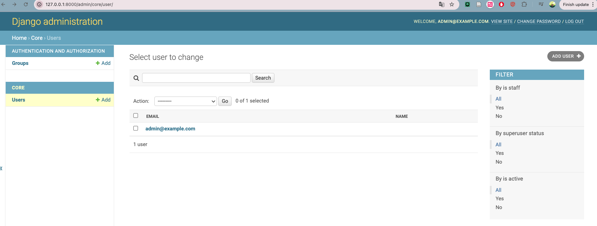
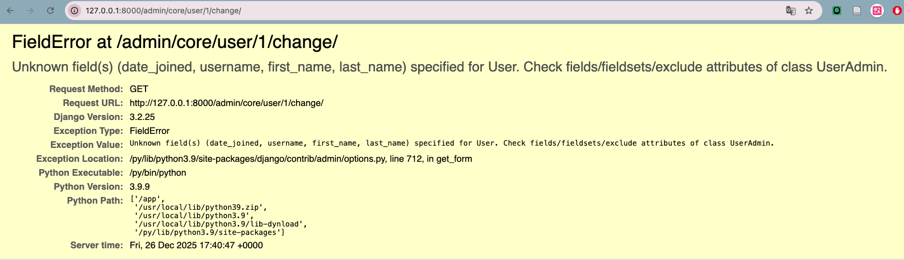
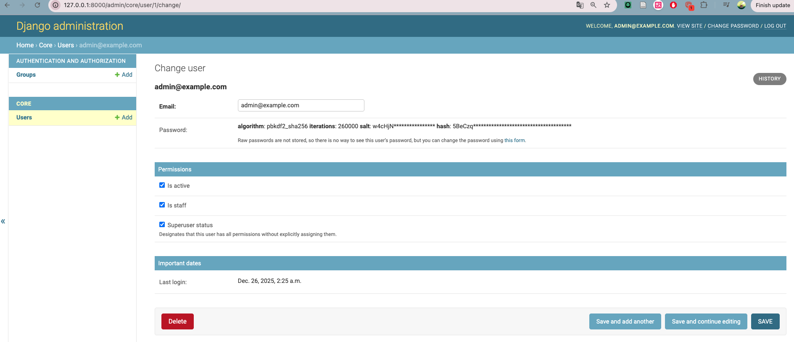
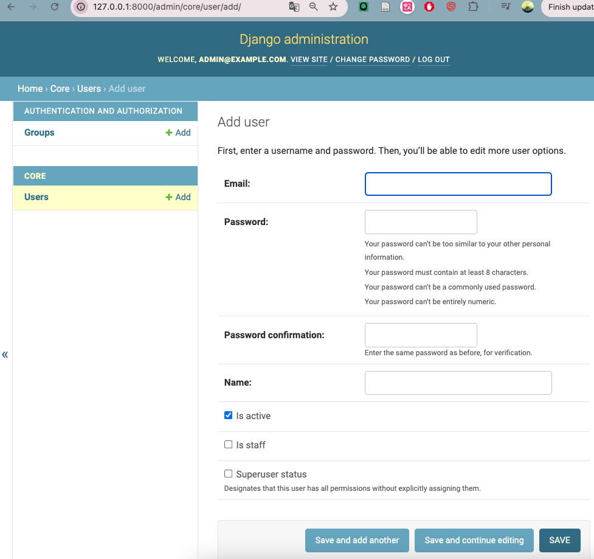

## Setction overview
**- What is the Django admin?**
  - graphic user interface for models
    - create, read, update, delete
  - very little coding required
  
**- How to enable django admin**
  - enable per model
  - insede `admin.py`
    - `admin.site.register(Recipe)`

**- Customising django admin**
  - creatw cladd based off `ModelAdmin` or `UserAdmin`
  - override/set class objects
  - changing list of objects
    - `ordering`: changes order items appear
    - `list_display`: fields to appear in list
  - add/update page
    - `fieldsets`: control layout of page
    - `readonly_fields`: fields that cannot be changed
  - add page
    - `add_fieldsets`: fields displayed only on add page


## Create listing user test
1. Create`core/tests/test_admin.py`.
2. import:
   - `from django.test import TestCase` → base class for tests
   - `from django.contrib.auth import get_user_model` → helper function to get the default user model
   - `from django.urls import reverse` → 
   - `from django.test import Client` → django test client that allows to make http requests
3. Create methods `setUp` and `test_users_list` in class `AdminSiteTests`.
   1. the class checkes:
      - we can log into the admin as a superuser
      - the admin list page for users correctly shows our created user
   2. `setUp`
      - a special method in django, remind the spelling. Runs before every test method
      -  create one superuser and one regular user
      -  use superuser to login to the admin page
   3. `test_users_list`
      - builds the URL for the user list page inside admin, reverse admin urls **"admin:core_user_changelist"** are found at this [website](https://docs.djangoproject.com/en/3.1/ref/contrib/admin/#reversing-admin-urls)
      - loads that page using the logged-in test client
      - checks that the page(html code) shows the user's name and email — meaning the admin UI is displaying user info properly
      - Django’s assertContains internally: Checks res.status_code == 200 -> Looks inside res.content -> Verifies that self.user.name appears in the HTML text
4. Run `docker-compose run --rm app sh -c "python manage.py test"`, it should be failed


## Customise the django admin
1. head over to `admin.py`
   - override the base UserAdmin by adding the order and list_displaying
   - set 
        ```python 
        admin.site.register(models.User, UserAdmin)
        ``` 
        to register `model.User` and `UserAdmin` with the admin site. remember to add the `UserAdmin`, otherwise it will go with the defaul setting.
1. run the test again, it should pass
2. start the admin service `docker-compose up`
3. head over to the page http://127.0.0.1:8000/admin/core/user/. If you click admin@example.com, you will get a error, bc the default user change screen had some fields that we don't have in our custom user model yet.
   
   

   


## Issue Fixing: support modifying users
**Why**

To fix the issue we encountered above

**Steps**
1. `core/tests/test_admin.py`
   1. create a new method `test_edit_user_page`
   2. get the url like http://127.0.0.1:8000/admin/core/user/1/change/, but the id changes by different user_id that we passed in
   3. get the url after loging the test client
   4. check page responce status
   5. Run `docker-compose run --rm app sh -c "python manage.py test"`, it should be failed
2. `core_admin.py`
   1. import `from django.utils.translation import gettext_lazy as _`. It integrate django translation system, if you change the language of djang, this will make sure the change is implemented to anywhere you use the traslation shortcut `_`
   2. add 3 fieldsets
   3. set ladt_login read only
   4. run the test again, it should pass
3. run the container and head over to http://127.0.0.1:8000/admin/core/user/1/change/

    


## Support create users
**Steps**
1. `core/tests/test_admin.py`
   1. create a new method `test_create_user_page`
   2. apply the same logic as `test_edit_user_page`, just the urls are different
   3. Run `docker-compose run --rm app sh -c "python manage.py test"`, it should be failed
2. `core_admin.py`
   1. add add_fieldsets
   2. run the test again, it should pass
3. run the container and head over to http://127.0.0.1:8000/admin/core/user/1/change/
    