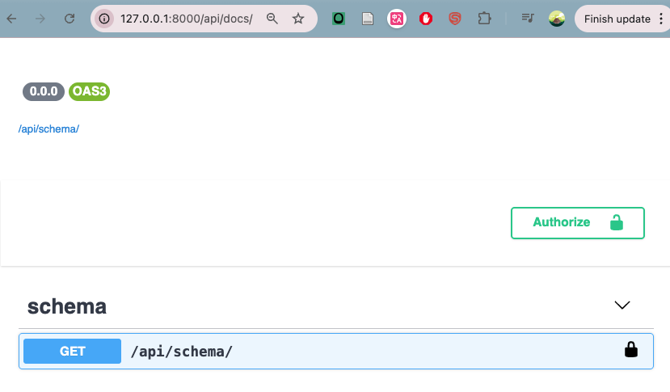

## API documentation overview
**Why document?**
- APIs are designed for devlopers to use
- need to know how to use it
- an API is only as good as it's document

**What to document?**
- everyyhing needed to use the API
- available endpoints (paths), eg /api/recipes
- supported methods, eg GET, POST, PUT PATCH, DELETE
- format of payloads(inputs), eg parameters, post JSON format
- format of responses (outputs), response JSON format
- authentication process

**Options for documentation**
- manaul, eg word doc, markdown
- **automated**
  - use metadata from code (comments)
  - generate documentation pages

**In this section**
- explore tools for making documentation seamless
- add documentation for our API


## Auto docs with Django Rust Framework (DRF)
**Docs in DRF**
- auto generate docs (with third party library drf-spectacular)
- generates schema, which is designe to be loaded into other tools to generate docs.
- browsable web interface
  - make test requests
  - handle auth

**How it work?**
1. generate "schema" filel, OpenAPI schema will be used in this course:
   - Standard for describing APIs
   - popular in industry
   - supported by most API documentation tools
   - use popular formats like yaml/jason
2. parse schema into GUI

**How to use a schema?**
- download and run in local Swagger instance
**- serve Swagger with API (this course gonna use)**


## Install drf-spectacular
1. Add drf-spetacular into `requirements.txt`, set the version
2. rebuild docker container by running `docker-compose build`
3. go to `.app/app/settings.py` to configure drf-spectacular into our project
   1. add the code below in `INSTALLED_APPS` to enable it into out django proj
   ```python
    'rest_framework',
    'drf_spectacular',
    ```
    2. configures the django rest frame work to use the 'drf_spectacular.openapi.AutoSchema' to generate the schema
    ```python
    RESR_FRAMEWORK = {
    'DEFAULT_SCHEMA_CLASSES': 'drf_spectacular.openapi.AutoSchema',
    }
    ```


## Add urls to serve our documentation
**Why?**
So now that we have installed drf spectacular into our project and set up the configuration, we just need to enable the URL's that are needed in order to serve the documentation through our Django project.

**Steps**
1. In `app/app/urls.py` file:
   1. import
      ```python
       from drf_spectacular.views import (
       SpectacularAPIView,
       SpectacularSwaggerView
       )
      ```
   2. add two urls
      - link `api/schema/` generate the schema for our api, it'a a yaml file
      - link `api/docs/` serve the swagger documentation that is going to use our schema to generate a graphical user interface for our API documentation.
2. test urls
    1. run `docker-compose up`
    2. go to http://127.0.0.1:8000/api/docs/, you should see:
        
    

## Summary
- Learned about API documentation
- Implemented Swagger and OpenAPI schema
- Tested documentation