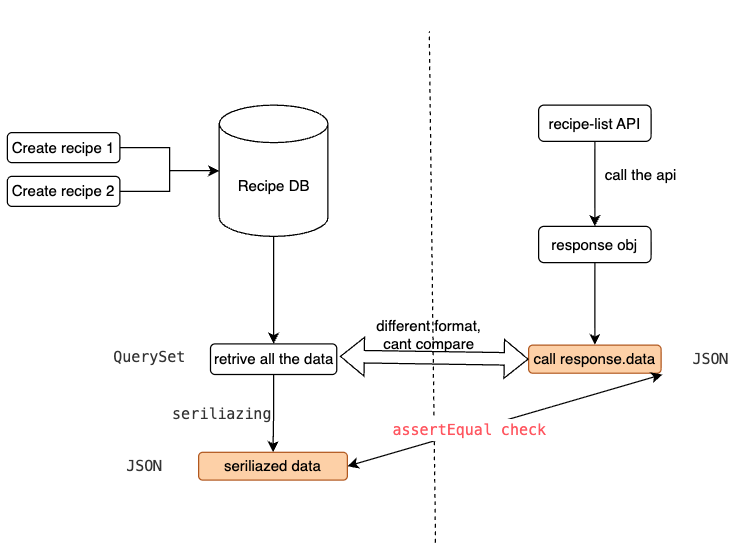

## Overview

### Features
- create
- list
- view detail by recipe id
- update
- delete
All the features will be availble for the recipe of the authenticated user

### Endpoints
- /recipes/
  - GET, list all recipes
  - POST, create recipes
- /recipes/<recipe_id>/
  - GET, view details of recipes
  - PUT/PATCH, update recipes
  - DELETE, delete recipes

### APIView V.S. Viewsets
**What is a view?**
- handles a request made to a URL
- django uses fuctions
- DRF uses classes
  - reusable logic
  - override behaviour
- DRF also supports decorators
- APIView and Viewsets = DRF base classes

**APIView**
- focused around HTTP methods
- class methods for HTTP methods
  - GET, POST, PUT, PATCH, DELETE
- provide flexibility over URLs and logic
- useful for non CRUD APIs
  - avoid for simple Create, Read, Update, Delete APIs
  - bespoke logic (eg: auth, creating jobs, external apis)
  
**Viewsets**
- focus around actions
  - retrieve, list, update, partial update, destory
- map to django models
- use Routers to generate URLs
- create for CRUD oprations on models


## Build Recipe Model
to store the recipe data

### Write test for recipe model
- `app/core/tests/test_models.py`, the core app is where we store all shared methods over all apps
  - import `from decimal import Decimal`, used for storing price for recipe obj, accuate: integer > decimal > floats
  - add new method `test_create_recipe`.
    - create a test user
    - create a recipe by using the method we are going to create
    - assert the title of the model
- Run `docker-compose run --rm app sh -c "python manage.py test"`, it should fail
  
### Implement recipe model
`app/core/models.py`
- import `from django.conf import settings` to set up a relationship between recipe model and user model
- create a class `Recipe`
  - **feilds**
    - user, set foreign key to map to user , `on_delete=models.CASCADE` if deleted a user, the recipes that the user created will be deleted as well
    - title
    - description
    - time_minutes, minutes take to create a recipe
    - price
    - link
  - `__str__`, the special method of the class allows you to the string representation of that obj, this affects how is displayed in django admin
  - add the recipe in `core/admin`
  - create the migrations by running `docker-compose run --rm app sh -c "python manage.py makemigrations"`
  - run the test, it should pass (the Django test run out will automatically apply all the migrations every time you run it. So it applies all the migrations and it clears all of the database and resupplies migrations every single time you run a test in the test suite. So that's why we didn't need to run the migration when we run our application.)


| Command | Full Name | Purpose | What It Does | When To Use |
|---------|-----------|---------|--------------|-------------|
| `python manage.py makemigrations` | Make Migrations | Prepare changes | Scans model changes and **creates migration files** (but does *not* touch the database) | Whenever you **add, remove, or modify fields/models** |
| `python manage.py migrate` | Apply Migrations | Execute changes | Reads migration files and **updates the database schema** (creates tables, adds columns, etc.) | After `makemigrations`, or when setting up a new project or pulling changes |


## Create Recipe App
- Run `docker-compose run --rm app sh -c "python manage.py startapp recipe"` in the terminal to create a new app - user inside our django proj. Here is the new structure:
```
    ├── app/
    │  ├── app/
    |  └── core/
    |  └── user/   
    |  └── recipe/      
    |  └── .flake8
    |  └── manage.py
```
- Inside user/, remove `migrations/`, `admin.py`, `models.py`, since we are gonna keep all the three in core app
- remove `tests.py`. And create `tests/` instead, do not forget create `__init__.py` inside it
- add this new user app to `INSTALLED_APPS` at `.app/app/settings.py`


## Build Recipe Listing API
### Write test for Recipe Listing API
create `test_recipe_api.py`.
- a helper function `create_recipe` to create a defaul recipe, and also allows us to override the values if we do need the changes for tests. `**params` , which will be a dictionary of all of the different parameters that was passed to the create recipe function.
- define the unauthenticated test class `PublicRecipeAPITests`
  - mothed `test_auth_required`, only logged in users can use the recipe
- define the authenticated test class `PrivateRecipeAPITests`
  - create an user and login to the api in `setUp`
  - `test_retrieve_recipes`
    - create 2 recipies
    - get the url response, `res` is the response object returned from calling the API, `res.dat`a` is the JSON-decoded content of the response, as returned by the DRF view.
    - retrive and sort the recipes from api, we will get a QuerySet of Recipe objects retrieved directly from the database.
    - pass in the recipes we got above to the serializer to converts Django model instances(QuerySet) into a Python data structure (dict/list) suitable for JSON responses. pass in `many=True` here bc serializer is can either return a detail which is just one item, or we can return a list of items. And when you pass in many equals, true tells it that we want to pass in a list of items.
    - assert the data
    
    

    - `test_recipes_limited_to_user` check if it only return the recipes created by the current logged in user 
      - strucure is similar to the previous one
      - create 2 recipes by 2 users
      - retrive all the data from db, and filter it by one user, and then serializer it
      - check the data and if the number of the retrived data is 1.
- run `docker-compose run --rm app sh -c "python manage.py test"`, it should be failed

### Implement Recipe Listing API
- create `app/recipe/serializers.py`
  - import `from rest_framework import serializers`, serializer is simply a way to convert objects to and from python objects. It takes a json input that might be posted from the API and validates the input to make sure it is secure and correct as part of validation rules. And then it converts it to either a python object that we can use or a model in our actual database.
  - create class `RecipeSerializer`
    - `serializers.ModelSerializer` They allow us to automatically validate and save things to a specific model that we define in our serialization.
    - create class `Meta` So this is where we tell the Django rest framework, the model and the fields and any additional arguments that we want to pass to the serialize set and the serialized needs to know which model it's representing and the way it does.

- create a view to use this serializer
  - head over to `app/recipe/views.py`
  - override the `get_queryset` method to make sure the recipes retrived by the api are filtered down by the authenticated user
  - 
- wire up an url to this view(the reverse url we set in the test)
  - create `app/recipe/urls.py`, set reverse mapping. any request that gets passed to that URL is going to be handled by the view that we defined here.
  - head over to `app/app/urls.py`, connect the view in our main app
- run the test, it shoul pass


## Build Recipe Detail API
### Write test for Recipe detail API


## Build Recipe Creating API


## Test recipe API in browser

